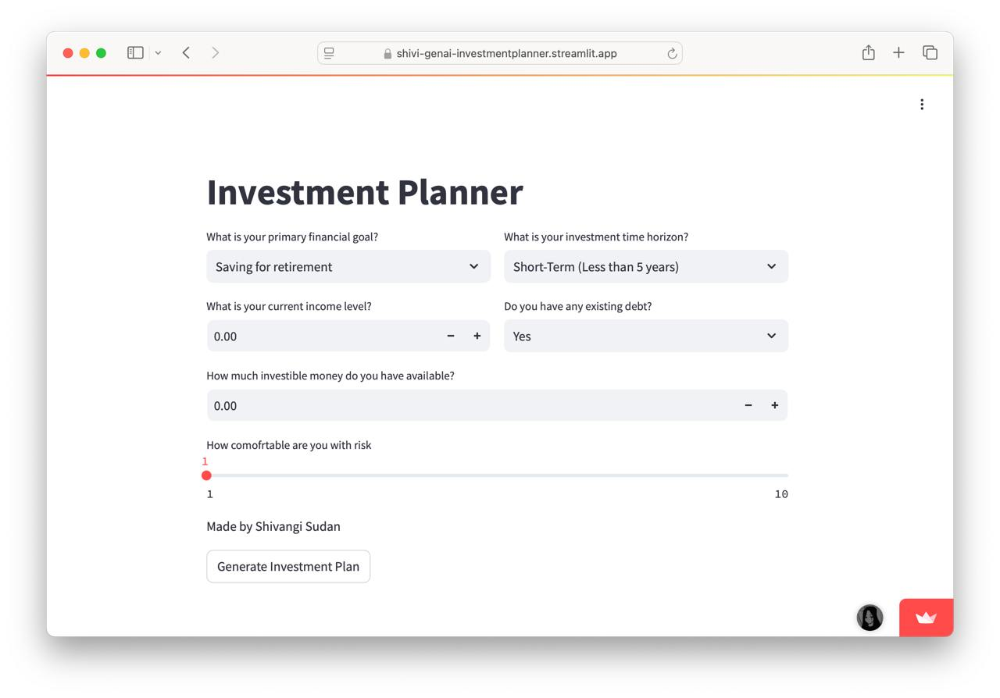

# Investment Planner

**Live App:** [Shivi's GenAI Investment Planner](https://shivi-genai-investmentplanner.streamlit.app/)

## Overview

The Investment Planner is an interactive, AI-powered application designed to help users create a personalized investment plan aligned with their financial goals and risk tolerance. Leveraging the capabilities of large language models (LLMs), this tool guides you through the process of clarifying your investment objectives, assessing your comfort with risk, and suggesting a suitable asset allocation strategy.

## Key Features

- **Set Goals:** Tell the app what you’re saving or investing for—like retirement, a house, or just building wealth.
- **Know Your Risk:** Choose from conservative, balanced, or aggressive approaches.
- **Personalized Recommendations:** Get a mix of stocks, bonds, and other investments matched to your profile.
- **On-the-Spot Guidance:** The AI tailors advice instantly, helping you understand the “why” behind each suggestion.

## Tech Stack Used

  **Streamlit:** For building the interactive web interface

  **Google Generative AI API:** For creating tailored investment suggestions

  **Python:** The core language behind the logic and integrations
